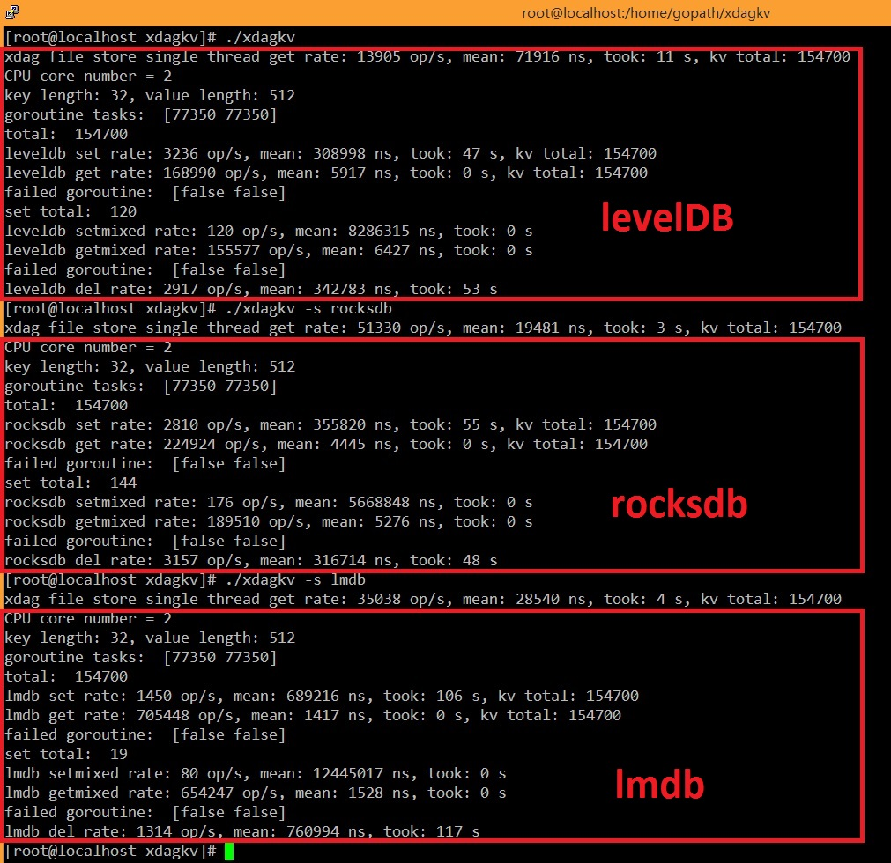
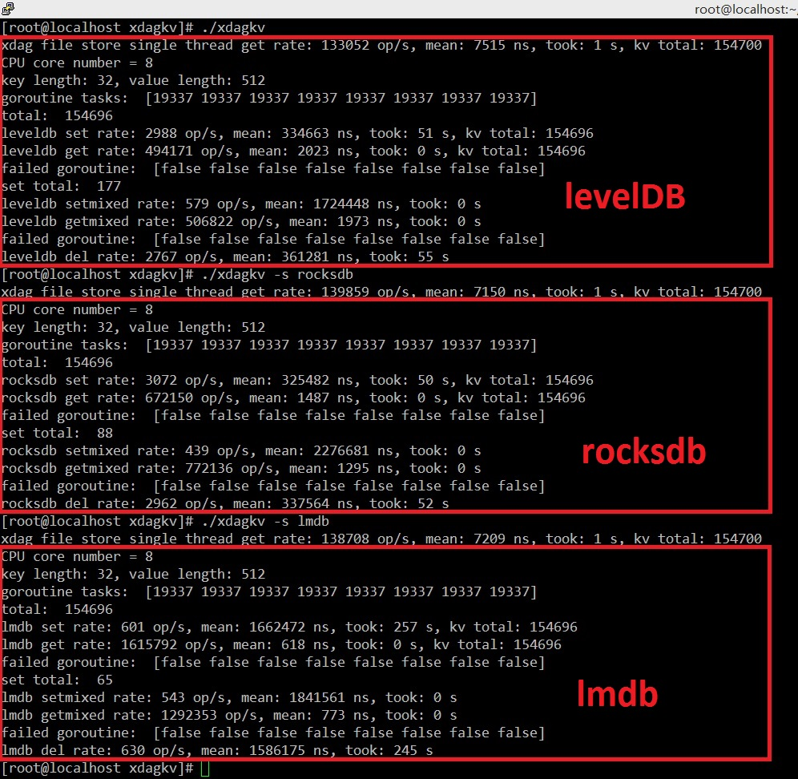
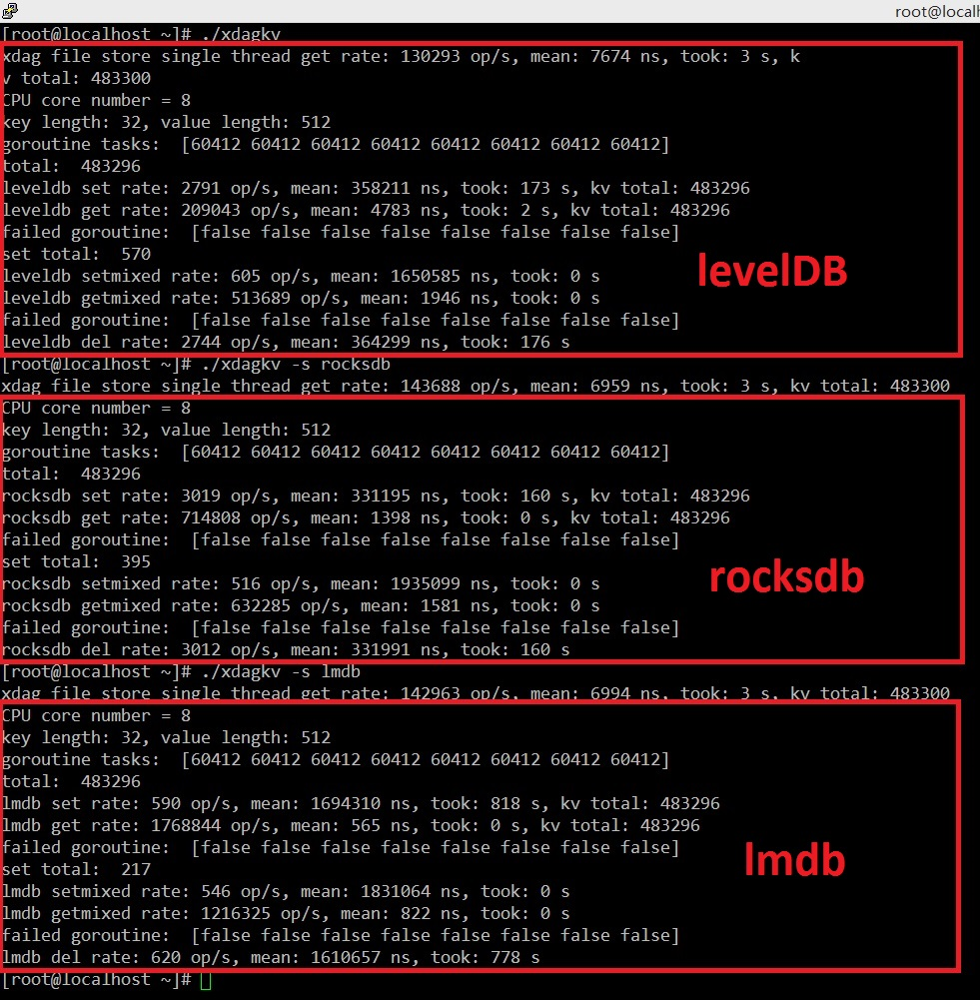

# XDAG KV Bench

forked from [smallnest/kvbench](https://github.com/smallnest/kvbench)

Features:

- Data
  - [kbs1-storage-testnet-2019-03-18.tar.gz](https://storage.xdagpool.com/files/testnet/legacy/kbs1-storage-testnet-2019-03-18.tar.gz)
  - more than 480000 XDAG blocks
  - 32 bytes address as key and 512 bytes block as value
- OS
  - CentOS 7 86_x64
  - ulimit -n 655360

- KV Store  
  - [golang version of levelDB](https://github.com/syndtr/goleveldb)
  - [golang binding of rocksdb 6.1.2](https://github.com/tecbot/gorocksdb)
  - [golang binding of lmdb 0.9.22](https://github.com/bmatsuo/lmdb-go)

  All KV store are using default option, no optimization is set.

- Testing
  - XDAG: single thread get blocks into memory from XDAG storage
  - set: multi goroutines (number of cores) put key-values
  - get: multi goroutines (number of cores) get key-values
  - setmixed: single goroutine put key-values with getmixed, stop putting kv when getmixed finished
  - getmixed: multi goroutines (number of cores) get key-values with setmixed
  - del: multi goroutines (number of cores) delete key-values
  - ignore XDAG check sum

## VirtualBox in laptop benchmark

### 2 core CPU, 2G RAM, 154700 key-values

#### throughputs (op/s)

|          | leveldb | rocksdb | lmdb    | XDAG    |
| -------- | ------- | ------- | ------- | ------- |
| set      | 3236    | 2810    | 1450    |         |
| setmixed | 120     | 176     | 80      |         |
| get      | 168990  | 224924  | 705448  | 13905   |
| getmixed | 155577  | 189510  | 654247  |         |
| del      | 2917    | 3157    | 1314    |         |

#### time (latency ns )

|          | leveldb | rocksdb | lmdb    | XDAG    |
| -------- | ------- | ------- | ------- | ------- |
| set      | 308998  | 355820  | 689216  |         |
| setmixed | 8286315 | 5668828 | 12445017|         |
| get      | 5917    | 4445    | 1417    | 71916   |
| getmixed | 6427    | 5276    | 1528    |         |
| del      | 342783  | 316714  | 760994  |         |

## desktop benchmark #1

### 8 core CPU, 24G RAM, 154696 key-values

#### throughputs( op/s)

|          | leveldb | rocksdb | lmdb    | XDAG    |
| -------- | ------- | ------- | ------- | ------- |
| set      | 2988    | 3072    | 601     |         |
| setmixed | 579     | 493     | 543     |         |
| get      | 494171  | 672150  | 1615792 | 133052  |
| getmixed | 506822  | 772136  | 1292353 |         |
| del      | 2767    | 2962    | 630     |         |

#### time (latency  ns)

|          | leveldb | rocksdb | lmdb    | XDAG    |
| -------- | ------- | ------- | ------- | ------- |
| set      | 334663  | 325482  | 1162472 |         |
| setmixed | 1724448 | 2276681 | 1841561 |         |
| get      | 2023    | 1487    | 618     | 7515    |
| getmixed | 1973    | 1295    | 773     |         |
| del      | 361281  | 337564  | 1586175 |         |

## desktop benchmark #2

### 8 core CPU, 24G RAM, 483296 key-values

#### throughputs(op/s)

|          | leveldb | rocksdb | lmdb    | XDAG    |
| -------- | ------- | ------- | ------- | ------- |
| set      | 2791    | 3019    | 590     |         |
| setmixed | 605     | 516     | 546     |         |
| get      | 209043  | 714808  | 1768844 | 130293  |
| getmixed | 513689  | 632285  | 1216325 |         |
| del      | 2744    | 3012    | 620     |         |

#### time (latency ns)

|          | leveldb | rocksdb | lmdb    | XDAG    |
| -------- | ------- | ------- | ------- | ------- |
| set      | 358211  | 331195  | 1694310 |         |
| setmixed | 1650585 | 1936099 | 1831064 |         |
| get      | 4783    | 1398    | 565     | 7674    |
| getmixed | 1946    | 1581    | 822     |         |
| del      | 364299  | 331991  | 1610657 |         |

